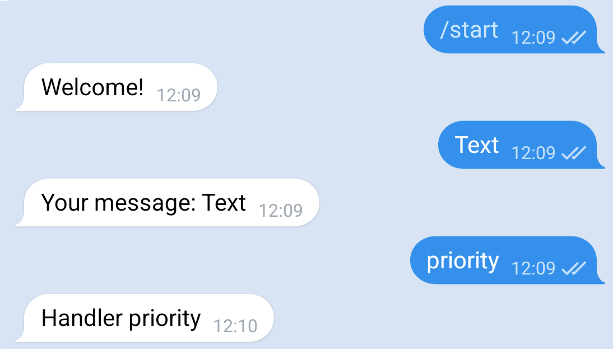

# TelegramGLib [](https://core.telegram.org/bots/api-changelog#april-21-2023)
[](http://t.me/codefaq)  
[](https://github.com/SpikedPaladin/TelegramGLib)  
TelegramGLib is a bot api for telegram written in Vala

## Features
- Inline mode support
- Async request sending
- File uploading
- Android support

## Sample

#### Vala
```vala
using Telegram;

void main() {
    new ReadMeBot().start();
}

public class ReadMeBot : Bot {
    
    construct {
        // Token from variable:
        // token = Environment.get_variable("TOKEN");
        token = "YOUR_BOT_TOKEN";
        
        // Debug mode.
        debug = true;
    }
    
    public override void update_recieved(Update update) {
        if (update.message != null && update.message.text != null) {
            var msg = new SendMessage();
            msg.chat_id = update.message.chat.id;
            msg.reply_to_message_id = update.message.message_id;
            msg.text = @"Your message: $(update.message.text)";
            
            send.begin(msg);
        }
    }
}
```

##### Compile with

    $ valac --pkg telegram-glib-0.3 main.vala
    $ ./main

##### Result


##### More examples

* [TelegramGLib-Examples](https://github.com/SpikedPaladin/TelegramGLib-Examples) repository

## Uploading files
```vala
var request = new SendPhoto();
request.chat_id = update.message.chat.id;
// To upload local file use prefix 'file://'
// File will be uploaded from local folder (/home/paladin/Pictures/upload.jpg)
request.photo = "file:///home/paladin/Pictures/upload.jpg";

send.begin(request);
```

## Installation

**[Installation for Android (Guide)](https://gist.github.com/SpikedPaladin/c51d95773fa851c6e54e8ae1cf4e5b10)**

#### Dependencies
> json-glib-1.0  
> libsoup-3.0

#### Build manualy

    $ meson setup --prefix=/usr build
    $ cd build
    $ ninja install

## TODO
- [ ] Webhook support
- [ ] Write documentation
- [ ] Telegram passport support

